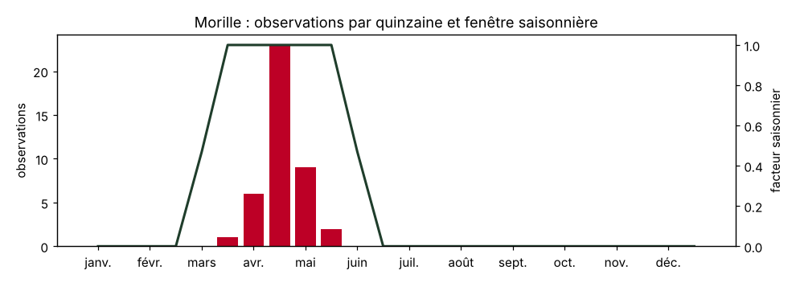
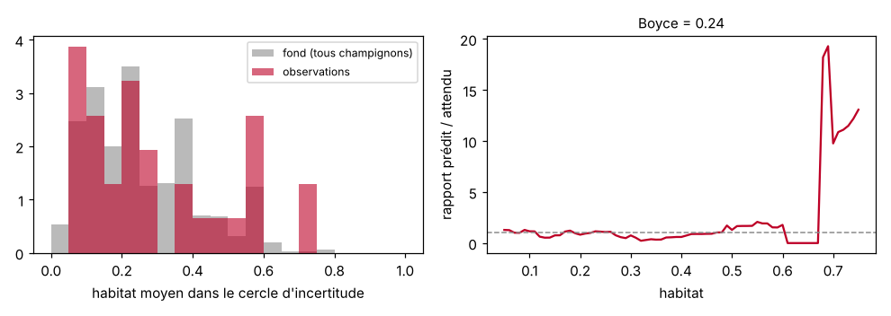

# Calibrage – Morille

Généré le 07/11/2026. Taxons : Morchella.

> **Rapport de diagnostic.** Les règles de `config/especes/morille.yaml` ne sont pas modifiées automatiquement.

## Données

| | Nombre |
|---|---:|
| Observations GBIF dans les départements (≥ 2005, CC0, CC BY, CC BY-NC) | 41 |
| … datées au jour près (phénologie) | 41 |
| … localisées à ≤ 3000 m (habitat, météo) | 32 |
| Fond « target-group » : observations de champignons localisées | 30199 |

Principaux jeux de données (GBIF) :

- 50c9509d-22c7-4a22-a47d-8c48425ef4a7 : 16
- 96cb0072-426e-4c30-875d-9201aecc15ff : 5
- 0155b886-98a0-4d3e-88b2-9fd0513e647e : 5
- f43dadbd-df8d-4db2-95f4-e69872c4384c : 5
- 26dfdca2-d8a1-4135-a03a-b669b67eb187 : 4
- 258c29cc-51f6-43f5-b702-3a833921a008 : 2

Requête GBIF : https://api.gbif.org/v1/occurrence/search?hasCoordinate=true&hasGeospatialIssue=false&occurrenceStatus=PRESENT&decimalLatitude=44.6959,45.8834&decimalLongitude=3.0822,6.3593&year=2005,2026&license=CC0_1_0,CC_BY_4_0,CC_BY_NC_4_0

## Phénologie

Observations hors de la fenêtre saisonnière du modèle : **0 %**.

## Habitat

L'habitat est moyenné dans le cercle d'incertitude de chaque observation, puis comparé au même calcul sur le fond.

- AUC observations / fond : 0.54 (faible)
- Indice de Boyce continu : 0.27 (faible)

### Composition : essences

Part moyenne de chaque classe dans les cercles (observations et fond), et valeur attribuée par la règle.

|  | valeur_regle | part_observations | part_fond | ratio |
|---|---|---|---|---|
| melange_feuillus | 0.70 | 0.42 | 0.36 | 1.16 |
| sapin_epicea | 0.80 | 0.29 | 0.26 | 1.14 |
| mixte_feuillus | 0.50 | 0.06 | 0.08 | 0.83 |
| chataignier | 0.20 | 0.07 | 0.07 | 1.08 |
| mixte_coniferes | 0.70 | 0.07 | 0.06 | 1.08 |
| chenes_decidus | 0.40 | 0.04 | 0.04 | 0.91 |
| autres_feuillus | 0.80 | 0.03 | 0.03 | 0.85 |
| pin_sylvestre | 0.30 | 0.00 | 0.02 | 0.05 |
| foret_ouverte | 0.60 | 0.00 | 0.02 | 0.10 |
| hetre | 0.30 | 0.00 | 0.02 | 0.20 |
| melange_coniferes | 0.70 | 0.01 | 0.01 | 0.46 |
| peupleraie | 0.80 | 0.00 | 0.01 | 0.19 |
| douglas | 0.10 | 0.00 | 0.00 | 0.26 |
| robinier | 0.30 | 0.00 | 0.00 | 0.00 |
| autres_pins | 0.30 | 0.00 | 0.00 | 0.00 |
| meleze | 0.80 | 0.00 | 0.00 | 0.00 |

### Composition : substrat

Part moyenne de chaque classe dans les cercles (observations et fond), et valeur attribuée par la règle.

|  | valeur_regle | part_observations | part_fond | ratio |
|---|---|---|---|---|
| detritique_mixte | 0.80 | 0.41 | 0.40 | 1.02 |
| calcaire | 0.90 | 0.28 | 0.20 | 1.44 |
| siliceux | 0.50 | 0.04 | 0.17 | 0.21 |
| marno_calcaire | 0.90 | 0.20 | 0.15 | 1.28 |
| alluvions_recentes | 1.00 | 0.05 | 0.07 | 0.72 |
| indetermine | 0.60 | 0.03 | 0.02 | 1.87 |

## Météo à la date d'observation

Météo historique non évaluée.

## Règles à revoir

- Habitat : AUC 0.54, le modèle distingue mal les zones observées du fond.
