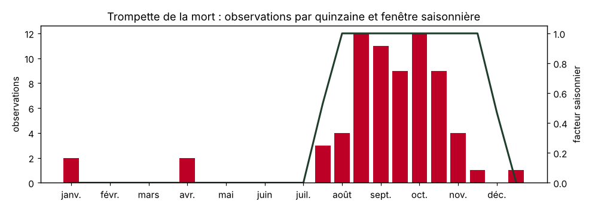
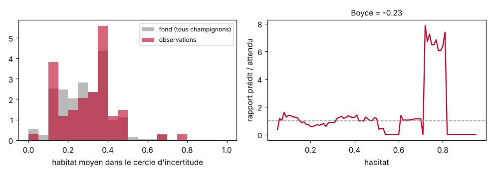

# Calibrage – Trompette de la mort

Généré le 07/11/2026. Taxons : Craterellus cornucopioides.

> **Rapport de diagnostic.** Les règles de `config/especes/trompette.yaml` ne sont pas modifiées automatiquement.

## Données

| | Nombre |
|---|---:|
| Observations GBIF dans les départements (≥ 2005, CC0, CC BY, CC BY-NC) | 70 |
| … datées au jour près (phénologie) | 70 |
| … localisées à ≤ 3000 m (habitat, météo) | 68 |
| Fond « target-group » : observations de champignons localisées | 30199 |

Principaux jeux de données (GBIF) :

- 0155b886-98a0-4d3e-88b2-9fd0513e647e : 34
- 130d809d-87a5-4d74-a113-0fbf30d33e45 : 11
- 26dfdca2-d8a1-4135-a03a-b669b67eb187 : 6
- 50c9509d-22c7-4a22-a47d-8c48425ef4a7 : 5
- f43dadbd-df8d-4db2-95f4-e69872c4384c : 4
- d96a57d7-72ff-49af-a186-2e0aa74ea527 : 3

Requête GBIF : https://api.gbif.org/v1/occurrence/search?hasCoordinate=true&hasGeospatialIssue=false&occurrenceStatus=PRESENT&decimalLatitude=44.6959,45.8834&decimalLongitude=3.0822,6.3593&year=2005,2026&license=CC0_1_0,CC_BY_4_0,CC_BY_NC_4_0

## Phénologie

Observations hors de la fenêtre saisonnière du modèle : **7 %**.

## Habitat

L'habitat est moyenné dans le cercle d'incertitude de chaque observation, puis comparé au même calcul sur le fond.

- AUC observations / fond : 0.57 (faible)
- Indice de Boyce continu : -0.25 (faible)

### Composition : essences

Part moyenne de chaque classe dans les cercles (observations et fond), et valeur attribuée par la règle.

|  | valeur_regle | part_observations | part_fond | ratio |
|---|---|---|---|---|
| melange_feuillus | 0.90 | 0.43 | 0.36 | 1.18 |
| sapin_epicea | 0.40 | 0.28 | 0.26 | 1.08 |
| mixte_feuillus | 0.90 | 0.07 | 0.08 | 0.89 |
| chataignier | 0.50 | 0.07 | 0.07 | 1.09 |
| mixte_coniferes | 0.60 | 0.04 | 0.06 | 0.68 |
| chenes_decidus | 0.50 | 0.02 | 0.04 | 0.48 |
| autres_feuillus | 0.70 | 0.03 | 0.03 | 0.87 |
| pin_sylvestre | 0.10 | 0.01 | 0.02 | 0.22 |
| foret_ouverte | 0.30 | 0.02 | 0.02 | 0.70 |
| hetre | 1.00 | 0.02 | 0.02 | 1.13 |
| melange_coniferes | 0.20 | 0.00 | 0.01 | 0.05 |
| peupleraie | 0.10 | 0.01 | 0.01 | 0.94 |
| douglas | 0.10 | 0.00 | 0.00 | 0.45 |
| robinier | 0.10 | 0.01 | 0.00 | 3.59 |
| autres_pins | 0.00 | 0.00 | 0.00 | 0.52 |
| meleze | 0.00 | 0.00 | 0.00 | 0.00 |

### Composition : substrat

Part moyenne de chaque classe dans les cercles (observations et fond), et valeur attribuée par la règle.

|  | valeur_regle | part_observations | part_fond | ratio |
|---|---|---|---|---|
| detritique_mixte | 0.80 | 0.47 | 0.40 | 1.17 |
| calcaire | 1.00 | 0.23 | 0.20 | 1.19 |
| siliceux | 0.60 | 0.03 | 0.17 | 0.15 |
| marno_calcaire | 1.00 | 0.19 | 0.15 | 1.20 |
| alluvions_recentes | 0.60 | 0.06 | 0.07 | 0.89 |
| indetermine | 0.70 | 0.03 | 0.02 | 1.61 |

## Météo à la date d'observation

Météo historique non évaluée.

## Règles à revoir

- Habitat : AUC 0.57, le modèle distingue mal les zones observées du fond.
